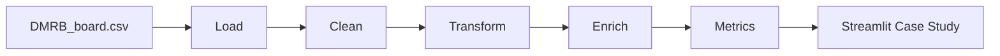

# Data Portfolio


A Streamlit-based data portfolio focused on **apartment operations analytics**, with a full case study on **Turnover & Make-Ready Intelligence**, plus AI-powered learning and productivity apps.

## Highlights

- End-to-end **ETL pipeline**: load → clean → transform → enrich → metrics
- **Operational analytics** grounded in real business workflows
- **AI apps** with event sourcing, state machines, and structured learning flows
- Clear, navigable **Streamlit experience** with project tabs and explanations

## Portfolio Apps

| Area | App/Page | Status | Description | Run |
| --- | --- | --- | --- | --- |
| Analytics & Data Engineering | Turnover & Make-Ready Intelligence | Complete | Full pipeline + operational insights from property turnover data | `streamlit run app.py` |
| Analytics & Data Engineering | Analytics Playground | Complete | SQL + pandas lab with schema, seed data, and query patterns | `streamlit run app.py` |
| Analytics & Data Engineering | Inventory Flow Analytics | Template | Placeholder structure for future inventory analytics | `streamlit run app.py` |
| Analytics & Data Engineering | Business Metrics Warehouse | In progress | Analytics warehouse design for revenue, customers, and repeat rate | `streamlit run app.py` |
| AI-Powered Applications | Personal Task & Goal Assistant | Complete | Event-sourced assistant with chat + task/goal extraction | `cd Ai/assistant && streamlit run assistant.py` |
| AI-Powered Applications | Data Analytics Apprenticeship | Complete | Stage-based learning engine (S0–S12) for pandas + SQL | `cd Ai/teacher && streamlit run app/teacher.py` |
| AI-Powered Applications | Concept Practice Engine | Complete | Topic-based practice engine with optional handout mode | `cd Ai/teacher_pract && streamlit run streamlit_app.py` |
| AI-Powered Applications | Code & Analytics Apprenticeship | Complete | Topic-based learning engine for code + analytics | `cd Ai/metacode && streamlit run streamlit_app.py` |

## Featured Case Study: Turnover & Make-Ready Intelligence

Problem: Coordinating make-ready work across units and vendors, tracking stalled units, and reconciling board dates with official property reporting.

What it includes:
- Operational pipeline and reconciliation logic
- SLA and lifecycle metrics (DV, DTBR, task aging)
- Task pipeline state and stall detection
- Streamlit case study walkthrough with SQL, analysis, and insights tabs

## Architecture (Turnover Pipeline)



## Quickstart

1. Create a virtual environment (optional)
2. Install dependencies

```bash
pip install streamlit pandas
```

3. Run the portfolio app

```bash
streamlit run app.py
```

## Data Notes

- The Turnover case study reads `data/raw/DMRB_board.csv`.
- If the file is missing, the page will show a helpful prompt.
- The repo includes scripts to export/trim this board data in `scripts/`.

## Repo Structure

```text
.
├── app.py
├── pages/
├── pipeline/
├── sql/
├── visuals/
├── data/
│   ├── raw/
│   ├── cleaned/
│   └── processed/
├── Ai/
│   ├── assistant/
│   ├── teacher/
│   ├── teacher_pract/
│   └── metacode/
├── docs/
└── scripts/
```

## Tech Stack

- Python
- Streamlit
- Pandas
- SQLite
- SQL

## Security

Secrets are excluded via `.gitignore`. If you run AI apps, set `OPENAI_API_KEY` locally in your environment or a non-tracked `.env` file.

## License

No license file is included yet. Add one if you want to make reuse terms explicit.
